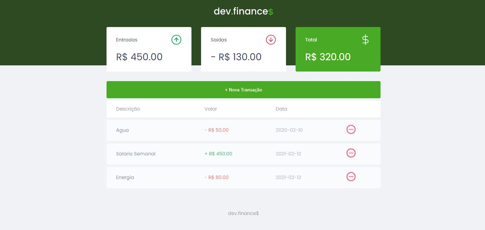
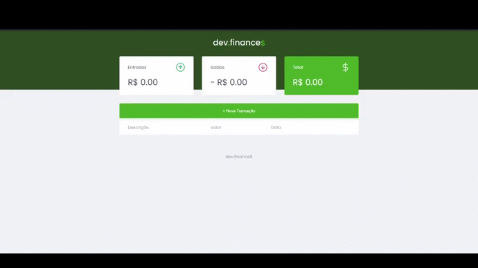

<h1 align=center>

</h1>


<h3 align="center">

Dev.finances é um projeto **Open Source** desenvolvido na  **Maratona Discover** da **[Rocketseat][rocketseat_site]** utilizando ***HTML, CSS e Javascript***. Este repositorio e uma versão desenvolvido utilizando ***React e Typescript***

</h3>

<h1 align=center>

</h1>

## **:wine_glass: COMO UTILIZAR**

### Configurações Iniciais

Primeiro, você precisa ter o <kbd>[NodeJS](https://nodejs.org/en/download/)</kbd> instalado na sua máquina.

### Utilizando o Website

```sh
# Abra o terminal no diretorio e execute o comando:
$ npm run start
```

> Se o browser não abrir automaticamente, acesse: http://localhost:3000.

## **:star2: AGRADECIMENTOS**

<div align="space-around">

 

 

</div>

## **:books: REFERÊNCIAS**

- [React + TypeScript Cheat Sheet](https://github.com/typescript-cheatsheets/react-typescript-cheatsheet)
- [Blog Rocketseat](https://blog.rocketseat.com.br/)
- [ReactJS](https://reactjs.org/docs/getting-started.html) | [ReactJS pt-BR](https://pt-br.reactjs.org/docs/getting-started.html)
- [TypeScript](https://www.typescriptlang.org/docs/home.html)
- [Node](https://nodejs.org/en/)

<h3 align="center">
Feito por <a href="https://www.linkedin.com/in/ma-nobrega/">Matheus Nobrega</a>
</h3>

<!-- Website Links -->

[rocketseat_site]: https://rocketseat.com.br/

<!-- Badges -->

[BADGE_CLOSED_ISSUES]: https://img.shields.io/github/issues-closed/MatheusNobrega/ecoleta?color=red

[BADGE_OPEN_ISSUES]: https://img.shields.io/github/issues/MatheusNobrega/ecoleta?color=green

[BADGE_LICENSE]: https://img.shields.io/github/license/MatheusNobrega/ecoleta

[BADGE_NODE_VERSION]: https://img.shields.io/badge/node-12.17.0-green

[BADGE_NPM_VERSION]: https://img.shields.io/badge/npm-6.14.4-red

[BADGE_WEB_REACT]: https://img.shields.io/badge/web-react-blue

[BADGE_SERVER_NODEJS]: https://img.shields.io/badge/server-nodejs-important

[BADGE_STARS]: https://img.shields.io/github/stars/MatheusNobrega/ecoleta?style=social

[BADGE_FORKS]: https://img.shields.io/github/forks/MatheusNobrega/ecoleta?style=social

[BADGE_TYPESCRIPT]: https://badges.frapsoft.com/typescript/code/typescript.png?v=101

[BADGE_OPEN_SOURCE]: https://badges.frapsoft.com/os/v1/open-source.png?v=103

<!-- Techs -->

[react]: https://reactjs.org/

[typescript]: https://www.typescriptlang.org/

[node]: https://nodejs.org/en/

[vscode]: https://code.visualstudio.com/

[markdown_emoji]: https://gist.github.com/rxaviers/7360908

[tsnode]: https://github.com/TypeStrong/ts-node

[react_router_dom]: https://github.com/ReactTraining/react-router/tree/master/packages/react-router-dom

[yarn]: https://classic.yarnpkg.com/en/docs/install/#debian-stable
